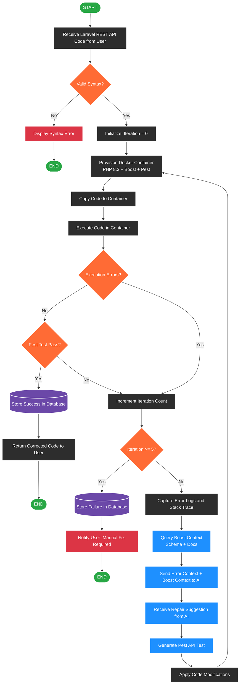
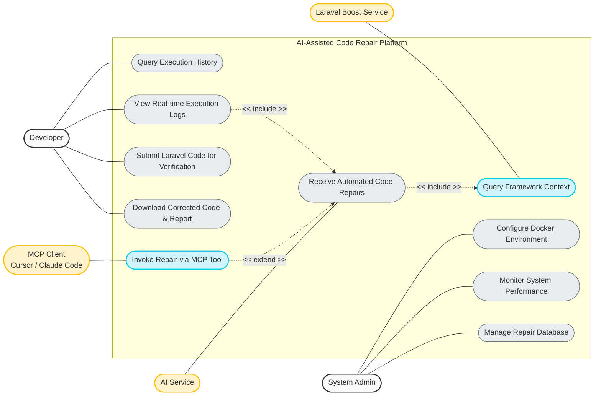
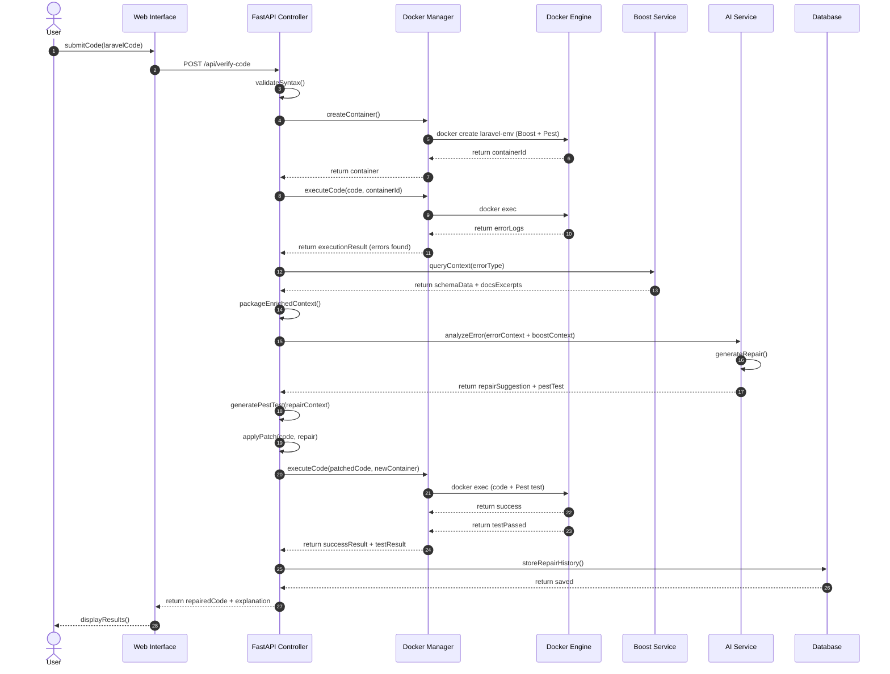
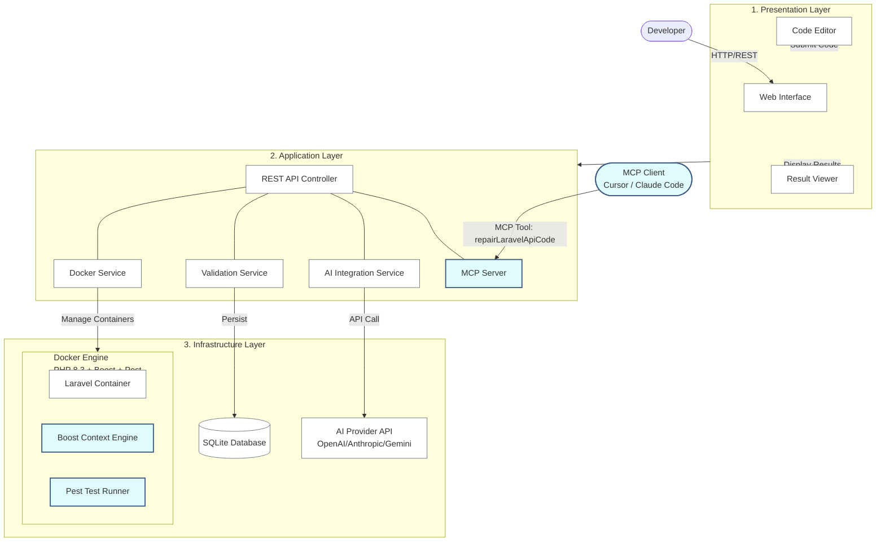
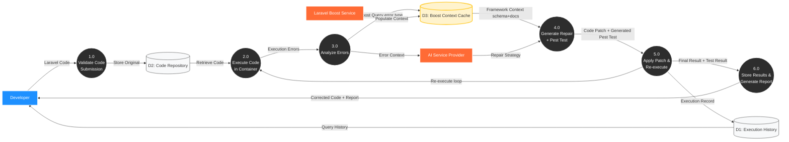

# Comprehensive Academic Report: The LaraVibe Autonomous Repair Platform

## Chapter 1: Introduction

### 1.1 Background to the Study
The rapid advancement of Large Language Models (LLMs) has fundamentally transformed the software engineering landscape. While generative AI excels at producing code snippets and assisting with boilerplate generation, its application in automated, closed-loop software repair remains fraught with challenges. Modern web frameworks, such as Laravel, demand strict adherence to architectural paradigms, dependency management, and robust testing standards. Traditional AI code generation tools lack the environmental awareness and iterative feedback loops necessary to safely integrate complex patches into existing, highly structured codebases. 

The LaraVibe project emerged as a response to the need for a deterministic, verifiable, and highly observable autonomous repair platform. By bridging the gap between raw generative AI and rigorous software testing, LaraVibe serves as an automated engineering partner capable of diagnosing, proposing, implementing, and verifying code fixes within an isolated sandbox environment.

### 1.2 Problem Statement
Despite the capabilities of modern LLMs, autonomous code repair systems frequently fail when applied to complex frameworks due to the following factors:
1. **Lack of Deterministic Verification**: AI-generated code often introduces subtle logic errors or syntax issues that go unnoticed without strict compilation and testing gates.
2. **Contextual Hallucinations**: Without precise awareness of the existing application state (e.g., database schema, route definitions, existing class structures), models hallucinate dependencies or overwrite critical logic.
3. **Infinite Loops and Non-Deterministic Failure**: Automated repair loops can get stuck in a cycle of generating the same flawed solution if the system lacks a "Critic" mechanism to enforce a strategy pivot after failures.
4. **Poor Observability & Integration**: Developers lack insight into the AI's internal reasoning, making it difficult to trust the autonomous repair process. Furthermore, many systems fail to integrate directly with modern development environments (IDEs).

### 1.3 Objectives of the Study
The primary objective of this project was to architect, deploy, and stabilize the LaraVibe platform—an encompassing, hybrid cloud/local system for autonomous code repair. Specific objectives included:
- Developing a multi-role agentic pipeline (Planner, Verifier, Executor, Reviewer, Critic) to ensure rigorous oversight of AI-generated patches.
- Architecting a hermetically sealed Docker sandbox environment utilizing strict security parameters to execute and validate untrusted AI code.
- Implementing a 13-step orchestration loop that integrates PHP static analysis, unit testing (Pest 3), and robustness validation (Mutation testing).
- Designing a high-fidelity, real-time observability frontend using React 19, Tailwind 4, and Server-Sent Events (SSE) to map the backend repair streams directly to a "Glass-Industrial" user interface.
- Integrating a Model Context Protocol (MCP) server to allow native integration with modern AI coding assistants (e.g., Cursor, Claude Code).

### 1.4 Scope of the Application
The LaraVibe ecosystem represents a full-stack orchestration engine. It spans a Python 3.12 FastAPI backend utilizing asynchronous I/O and SQLAlchemy 2.0; a React 19 single-page application frontend; a secure Docker execution sandbox built on Alpine Linux and PHP 8.3; and an MCP JSON-RPC integration layer. The system dynamically routes requests to various LLM providers (e.g., Groq, DeepSeek, Google Gemini, Anthropic, Ollama) and logs comprehensive forensic data in a local SQLite database.

---

## Chapter 2: Literature Review & Technological Foundation

### 2.1 The Evolution of Automated Program Repair (APR)
Automated Program Repair (APR) has historically relied on search-based heuristics, genetic algorithms, or symbolic execution to generate patches. While effective for simple localized bugs, these methods struggle with the complexity of modern MVC (Model-View-Controller) architectures like Laravel. The introduction of LLMs to APR brought unprecedented semantic understanding but introduced unpredictability. 

### 2.2 Agentic Workflows in LLMs
Recent research suggests that providing an LLM with a single prompt to fix a bug is less effective than dividing the cognitive load across multiple specialized agents. This "multi-agent" paradigm mirrors human software development teams. By segmenting the process into planning, execution, and review, the overall quality of the generated code increases significantly. The LaraVibe platform extends this by introducing a "Critic" role—a post-mortem analyzer (`escalation_service`) that forces the Executor to pivot its strategy if consecutive test failures occur.

### 2.3 Hermetic Execution & Containerization
Executing AI-generated code poses severe security risks, known as the "Code Injection" threat. Industry standards dictate the use of isolated, ephemeral environments. Containerization technologies, such as Docker, provide the necessary boundaries. Furthermore, testing cannot rely solely on simple unit tests; mutation testing (`pest --mutate`)—which deliberately injects faults into the code to ensure the test suite catches them—has emerged as the gold standard for validating the robustness of AI-generated patches.

### 2.4 Model Context Protocol (MCP)
The Model Context Protocol (MCP) is an emerging open standard that enables AI models to securely access external tools and data sources. By exposing a JSON-RPC 2.0 server over `stdio`, systems like LaraVibe can integrate directly into an IDE's context, allowing developers to offload complex repairs to a dedicated backend sandbox without leaving their editor.

---

## Chapter 3: Methodology and System Architecture

### 3.1 Global Architecture
The platform operates as a multi-tier web application orchestration engine:
1. **Frontend (laravibe-fe)**: A React 19 SPA with TypeScript and Tailwind 4.
2. **Coordinator API (api)**: A FastAPI Python 3.12 server utilizing `asyncio` for non-blocking database writes and LLM calls.
3. **Sandbox Runtime**: A strictly controlled Docker container running PHP 8.3 and Laravel 12.
4. **AI Routing Layer**: A custom multi-provider dispatcher with automated failover and rate-limit handling.

### 3.2 The Hermetic Docker Sandbox
The execution environment is physically isolated via Docker containerization (`laravel-sandbox:latest`). 
- **Security Constraints**: The container operates with zero networking (`--network=none`), memory limits (`512m`), CPU constraints (`0.5`), and max PIDs (`64`) to prevent OOM attacks, fork bombs, and cryptomining.
- **Code Injection**: User code is never written to the host disk. Instead, it is streamed into the container at `/submitted/code.php` via Python's `tarfile` module utilizing an in-memory tar-streaming mechanism.
- **Persistent V2 Architecture**: A single container is created before the loop begins and is destroyed in a `finally` block at the end. This allows multi-iteration fixes (like creating new dependency files) to naturally persist across the lifecycle of a single submission.

### 3.3 The 13-Step Iterative Repair Loop
The core orchestration cycle runs up to `MAX_ITERATIONS` (default 4) until success is achieved. The exact state machine sequence is:
1. **Bootstrap**: `docker.copy_code()` injects the code.
2. **PHP Lint Gate**: `php -l` fails fast on syntax errors.
3. **Detect Class Info**: `laravel.detect_class_info()` reflective discovery.
4. **Place in Laravel**: PSR-4 placement and `composer dump-autoload`.
5. **Scaffold Route**: Registration of the API resource.
6. **Zoom-In Discovery**: Instead of passing the entire codebase to the LLM, the `discovery.py` service uses reflection via `artisan tinker` to scan code for `use` statements and extracts exact public method signatures of related dependencies. This "Zoom-In" approach drastically reduces context window bloat.
7. **Boost Context**: Fetching database schemas and docs via Laravel Boost (`boost_service`). Results are cached using `SHA-256(laravel_version + error_text)` to optimize API calls across similar iterations.
8. **Memory Recall**: RAG-lite retrieval of similar past repairs (`context_service`). The system scores past successful repairs mathematically: `retrieval_score = (similarity × 0.7) + (efficiency × 0.3)`, where similarity is derived from a SequenceMatcher ratio of the error signatures, and efficiency is `1 / iterations_needed`.
9. **Post-Mortem Analysis**: AI analyzes previous failures (Critic role).
10. **Planner Strategy**: AI designs the fix strategy.
11. **Executor Patching**: `patch_service.apply_all()` applies XML patches (`full_replace` or `create_file`).
12. **Functional Gate**: Baseline HTTP assertions run via `pest`.
13. **Quality Gate**: `pest --mutate` runs, requiring a score ≥ 80%.

### 3.4 AI Routing & Escalation Services
- **Dispatcher**: The system routes to LLM providers using tiered pools (e.g., `PLANNER_POOL` using `llama-3.3-70b-versatile` on Groq, falling back to Dashscope or Nvidia on `429 Rate Limit`).
- **JSON Recovery Pipeline**: LLMs frequently output malformed JSON when dealing with code. A custom brace-depth tracking parser (`_extract_json_object`) recovers valid objects even when wrapped in markdown or `<think>` blocks (common with DeepSeek R1). Crucially, an internal `_fix_json_escapes` function uses negative-lookbehind regex to repair single backslashes in PHP namespace strings (e.g., `App\Models\Product`) that would otherwise crash native JSON decoders.
- **Escalation Service**: A deterministic stuck-loop detector that evaluates four independent triggers after every failure:
  1. **Stuck Diagnoses**: If the last two diagnoses overlap ≥70%, it forces a completely different reasoning strategy.
  2. **Patch Failures**: If patches fail repeatedly, it bans partial actions (`replace`/`append`) and demands a `full_replace`.
  3. **Create-without-Fix**: If the AI creates a dependency but ignores the original file, it enforces a fix on the original code.
  4. **Dependency Guard**: Prevents the AI from repeatedly attempting to create the same missing file in an infinite loop.

### 3.5 Hybrid Cloud Deployment Strategy
To stabilize the platform on cloud hosting providers (e.g., Koyeb) while supporting Docker-in-Docker (DinD), an "Instant-On" startup strategy was implemented. The FastAPI Gunicorn server binds to the network port immediately to pass mandatory HTTP health checks. Simultaneously, the resource-intensive Docker image compilation runs in an asynchronous background subshell, streaming its initialization logs directly to the runtime console. This decouples the heavy sandbox bootstrap from the application's network availability.
### 3.6 System Modeling and Visualizations

The following diagrams illustrate the core orchestration flow, system boundaries, and data lifecycles within the LaraVibe platform.

#### 3.6.1 System Flowchart (Figure 3.1)
This flowchart details the 13-step orchestration loop, including the new Boost Context enrichment and Pest mutation testing gates.

#### 3.6.2 Use Case Diagram (Figure 3.2)
This diagram maps the system boundaries and introduces the MCP Client and Laravel Boost Service actors.

#### 3.6.3 Sequence Diagram (Figure 3.3)
Demonstrates the successful execution scenario resolving an error in two iterations.

#### 3.6.4 Architecture Diagram (Figure 3.4)
Illustrates the three-tier architectural layout including the new MCP Server layer.

#### 3.6.5 Data Flow Diagram (Figure 3.5)
Level-1 DFD detailing data transformation throughout the repair lifecycle.

---

## Chapter 4: Implementation, Data Modeling, & Integration

### 4.1 Database Infrastructure & Forensic Modeling
The platform utilizes an asynchronous SQLite database (`aiosqlite`) via SQLAlchemy 2.0 to maintain a highly detailed forensic record of all repairs.
- **`submissions` Table**: The root record tracking the global state, original code, and final repaired code. It includes metadata for batch evaluations (`case_id`, `experiment_id`).
- **`iterations` Table**: Linked 1:N to submissions. Stores a snapshot of *every single loop cycle*, including the `boost_context`, `ai_prompt`, the exact `ai_model_used`, and the `mutation_score` (even on failures, enabling comprehensive dataset distributions).
- **`repair_summaries` Table**: Populated only on successful repairs, powering the sliding-window RAG memory for the `context_service`.

### 4.2 Frontend Architecture (React 19 & "Glass-Industrial" Design)
The frontend is a modern Single Page Application built on React Router 7. URL-driven routing allows deep-linking directly to `Submission` UUIDs.
- **SSE Streaming Engine**: The UI connects to `GET /api/repair/{submission_id}/stream`. Backend orchestration events (`iteration_start`, `ai_thinking`, `patch_applied`) are mapped to distinct visual states.
- **3-Panel HUD**: 
  - *Context Panel (Left)*: Visualizes `boost_queried` events, highlighting affected DB tables.
  - *Repair Terminal (Center)*: A virtualized log scroller displaying real-time terminal output and amber `🔄` highlights for provider failovers.
  - *Code & Diffs (Right)*: CodeMirror side-by-side diffs updating in real-time as `patch_applied` events arrive.

### 4.3 MCP Integration (Cursor / Claude Code)
LaraVibe operates as a first-class citizen in modern development environments by exposing an MCP server (`mcp/server.py`). 
- **Tooling**: Exposes the `repairLaravelApiCode` tool via JSON-RPC 2.0 over `stdio`. 
- **Execution**: When a developer encounters an issue in Cursor, the IDE passes the broken code to the tool. The MCP server submits it to the FastAPI backend, polls the status, and returns the strictly verified, mutation-tested code directly to the developer's editor, fully abstracting the Docker and AI complexity.

### 4.4 Security Model
To maintain system integrity, strict boundaries are enforced:
- **Execution Containment**: The `docker_service` uses precise kwargs during container instantiation. `network_mode="none"` prevents data exfiltration. `mem_limit="512m"` prevents Out-of-Memory (OOM) payloads. `nano_cpus=int(0.5 * 1e9)` mitigates cryptomining risks. `pids_limit=64` stops fork bombs. Lastly, `security_opt=["no-new-privileges:true"]` prevents privilege escalation attacks inside the sandbox.
- **Guaranteed Cleanup**: To prevent container leaks resulting from application crashes, every `docker_service.create_container()` call is bound to a strict `try/finally` block that guarantees a `docker rm -f` command is executed when an iteration concludes.
- **Patch Blocklisting**: The `patch_service` actively blocks the AI from overwriting critical framework files (`routes/api.php`, `.env`, `composer.json`, `pest.php`), protecting the scaffolding that drives the repair loop.
- **API Key Security**: Secrets are loaded exclusively via `pydantic-settings` from an untracked `.env` file, preventing exposure in memory dumps or source control.

---

## Chapter 5: Evaluation Framework, Conclusion & Recommendations

### 5.1 Batch Evaluation & Ablation Study Design
The platform was built not just as a tool, but as a research instrument. It includes an evaluation orchestrator (`POST /api/evaluate`) driven by a `batch_manifest.yaml`.
- **Determinism**: All evaluations force `AI_TEMPERATURE=0.0`.
- **Ablation Flags**: The manifest includes flags like `use_boost_context: false` to measure the exact impact of context enrichment on repair success rates, and `use_mutation_gate: false` to measure the quality drop-off when strict testing is removed.
- **ROTATION_CHAIN**: For comparative model analysis, the system overrides the default provider on each iteration (e.g., Nvidia → Dashscope → Gemini) to test cross-model collaboration.

### 5.2 Conclusion
The LaraVibe Autonomous Repair Platform proves that agentic AI can achieve highly deterministic and reliable code repair when bounded by rigorous testing gates and strict environmental isolation. By combining a 13-step orchestration loop, hermetic Docker execution, real-time SSE observability, and seamless MCP integration, the platform transcends basic code generation. It successfully acts as an autonomous engineer capable of self-correcting its own logic, surviving syntax anomalies (e.g., XML parsing bugs), and surviving LLM rate-limit failures via resilient provider routing.

### 5.3 Recommendations for Future Work
1. **AST-Aware Delta Patching**: The current XML patching methodology should evolve to use Abstract Syntax Tree (AST) aware delta patching, allowing the Executor to modify specific class methods without overwriting entire files.
2. **Predictive Escalation Models**: The `escalation_service` currently relies on heuristic rules (e.g., fuzzy matching diagnoses). A lightweight classification model could be trained on the forensic database (`iterations` table) to predict and preempt failing strategies before executing computationally expensive mutation tests.
3. **Cross-Framework Expansion**: The modular nature of the `sandbox_service` allows the architecture to be ported beyond PHP/Laravel. Implementing equivalent Docker sandboxes for Python/FastAPI or TypeScript/NestJS would establish the platform as a universal APR orchestration engine.
