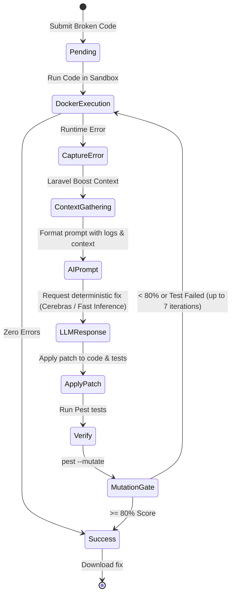

# Laravel AI-Enhanced Repair Platform - Project Manual

This manual provides a detailed technical overview of the Laravel AI Repair Platform. It explains the core architecture, the automated repair iteration loop, and what each directory and file does.

## Platform Architecture

The platform operates as a multi-tier web application orchestration engine. A FastAPI backend acts as the coordinator, interacting with an isolated Docker sandbox container (which runs Laravel PHP code) and integrating with an LLM for code repair.

```mermaid
flowchart TD
    subgraph Frontend [User Interface]
        UI[Vanilla JS + CodeMirror 6]
    end

    subgraph Backend [Coordinator API - FastAPI]
        API[main.py]
        Router[routers/]
        Services[services/]
        DB[(SQLite \n sqlalchemy + aiosqlite)]
    end

    subgraph Execution [Isolated Docker Runtime]
        Sandbox[Laravel Sandbox \n PHP 8.3 / Pest 3]
        Boost[Laravel Boost API]
    end

    subgraph AI [LLM Provider]
        Cerebras[Cerebras (OpenAI-compatible) \n temperature=0.0]
    end

    UI -- "Submits broken code" --> API
    API -- "CRUD via models.py" --> DB
    API -- "Runs code via docker_service.py" --> Sandbox
    Sandbox -- "Failure & Logs" --> API
    API -- "Fetches schema via boost_service.py" --> Boost
    API -- "Requests patch via ai_service.py" --> Cerebras
    Cerebras -- "Returns fix + Pest test" --> API
    API -- "Applies via patch_service.py" --> Sandbox
```

## The Iterative Repair Loop Workflow

The core mechanic of the system is the **7-Step Iterative Loop**. When code fails, the platform automatically diagnoses, fixes, and verifies it.



## Directory Reference ("Where does what")

### `api/` (Backend Coordinator)
The Python 3.12 FastAPI application coordinating the entire platform.
- **`main.py`**: The entry point for the FastAPI server, setting up lifespan events and DB init.
- **`models.py`**: SQLAlchemy ORM definitions (`Submission` and `Iteration`).
- **`routers/`**: HTTP endpoints including `/health`, `/repair`, `/history`, and `/evaluate`. The `evaluate.py` router automatically maps over the `dataset/` codebase directory via the `batch_manifest.yaml` definitions.
- **`services/`**: The core business logic.
  - `docker_service.py`: Safely spins up and destroys short-lived Docker containers (`--network=none`, `--pids-limit=64`).
  - `boost_service.py`: Communicates with Laravel Boost for live context.
  - `ai_service.py`: Orchestrates calls to Cerebras (or fallback Anthropic/OpenAI) for lightning-fast patch generations.
  - `patch_service.py`: Applies LLM-generated patches minimally.
  - `repair_service.py`: Orchestrates the main up-to-7-times iteration loop.

### `docker/` (Sandbox Environment)
- **`laravel-sandbox/Dockerfile`**: Definitions for building the container image (`laravel-sandbox:latest`). Runs an isolated Alpine + PHP 8.3 + Laravel 12 + Pest 3 environment.

### `dataset/` (Automated Evaluation)
- This directory stores the failing Laravel PHP code cases (`case-001`, `case-002`, etc.) used by the `batch_manifest.yaml` automated evaluation pipeline.

### `frontend/` (User Interface)
- **`index.html`**: The main page layout.
- **`app.js`**: Core Javascript handling CodeMirror 6, SSE (Server-Sent Events) for real-time progress, diff rendering with diff2html, and submission logic.
- **`style.css`**: Vanilla CSS for styling.

### `mcp/`
- **`server.py`**: Powered by the official MCP Python SDK to expose this platform as an AI capability for Claude Code and Cursor. Properly handles the mandatory `initialize` handshake.

### Root Files
- **`batch_manifest.yaml`**: The source of truth for all batch evaluation runs for the thesis. Configures `ai_provider` (e.g., Cerebras), `max_iterations`, and ablation flags.
- **`README.md`**: Quickstart operations guide.
- **`AI_REDESIGN_Specs.md`**: Guide for the upcoming modular Frontend redesign (React + Vite) with Supabase Basic Auth and enhanced history capabilities.
- **`.env` and `.env.example`**: Secure storage for keys (`CEREBRAS_API_KEY`, etc). Not committed to version control.

## Security & Concurrency Rules

- **Total Isolation:** Target code executes only inside Docker. Python runs strictly for orchestration.
- **Auto-Destruction:** All sandbox containers are forcefully killed inside a `finally` block in Python, avoiding memory leaks.
- **Determinism:** LLM generations run precisely at `temperature=0.0`.
